# VicharManthan - Startup Idea Sharing & Collaboration Platform

## 🚀 Overview of an application

VicharManthan is a comprehensive social media platform designed for startup idea sharing and collaboration. Founders can publish their ideas along with required skills and team size. Other users can upvote, like, comment, or submit proposals to join teams and contribute to exciting projects.

## ✨ Key Features

- **Idea Sharing**: Post startup ideas with detailed descriptions, categories, and stages
- **Team Building**: Connect founders with talented individuals through a proposal system
- **Real-time Chat**: Communicate with potential team members using Socket.io
- **Proposal System**: Apply to join interesting projects with your skills and experience
- **Upvoting & Comments**: Community-driven idea validation and feedback
- **User Profiles**: Showcase your skills, bio, and social links
- **Notifications**: Stay updated on activity related to your ideas
- **Search & Filter**: Find ideas by category, keywords, and popularity

## 🛠️ Tech Stack

### Backend
- **Node.js** & **Express.js** - Server framework
- **MongoDB** - Database with Mongoose ODM
- **Socket.io** - Real-time communication
- **JWT** - Authentication
- **bcryptjs** - Password hashing

### Frontend
- **React** - UI library
- **React Router** - Navigation
- **Axios** - HTTP client
- **Socket.io-client** - Real-time updates
- **Lucide React** - Modern icons

## 📁 Project Structure

```
VicharManthan/
├── backend/
│   ├── config/
│   │   └── db.js
│   ├── controllers/
│   │   ├── authController.js
│   │   ├── ideaController.js
│   │   ├── proposalController.js
│   │   ├── userController.js
│   │   ├── notificationController.js
│   │   └── chatController.js
│   ├── middleware/
│   │   └── auth.js
│   ├── models/
│   │   ├── User.js
│   │   ├── Idea.js
│   │   ├── Proposal.js
│   │   ├── Notification.js
│   │   └── Chat.js
│   ├── routes/
│   │   ├── auth.js
│   │   ├── ideas.js
│   │   ├── proposals.js
│   │   ├── users.js
│   │   ├── notifications.js
│   │   └── chats.js
│   ├── .env
│   ├── package.json
│   └── server.js
├── frontend/
│   ├── public/
│   ├── src/
│   │   ├── components/
│   │   │   ├── Navbar.js
│   │   │   └── IdeaCard.js
│   │   ├── context/
│   │   │   ├── AuthContext.js
│   │   │   └── SocketContext.js
│   │   ├── pages/
│   │   │   ├── Home.js
│   │   │   ├── Login.js
│   │   │   ├── Register.js
│   │   │   ├── Ideas.js
│   │   │   ├── IdeaDetail.js
│   │   │   ├── CreateIdea.js
│   │   │   ├── Profile.js
│   │   │   ├── Proposals.js
│   │   │   ├── Chats.js
│   │   │   └── Notifications.js
│   │   ├── App.js
│   │   ├── index.js
│   │   └── index.css
│   └── package.json
└── README.md
```

## 📱 Features Walkthrough

### For Founders
1. **Register/Login** - Create your account
2. **Post Ideas** - Share your startup idea with details
3. **Review Proposals** - Check applications from interested collaborators
4. **Build Team** - Accept proposals and add members to your team
5. **Chat** - Communicate with team members in real-time

### For Collaborators
1. **Browse Ideas** - Explore innovative startup ideas
2. **Upvote & Comment** - Engage with ideas you like
3. **Submit Proposals** - Apply to join projects that match your skills
4. **Track Applications** - Monitor status of your proposals
5. **Connect** - Chat with founders once accepted

## 📸 Screenshots

### 🏠 Home Page
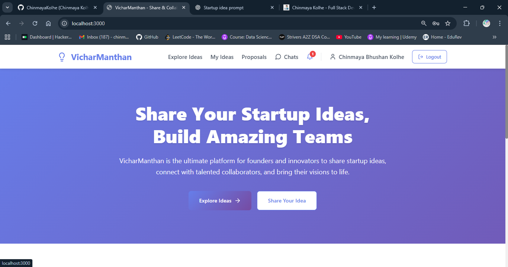

### 📝 Signup Page
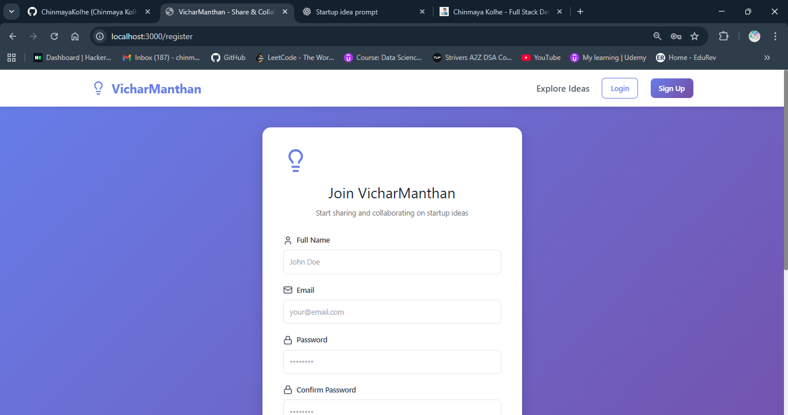

### 🔐 Login Page
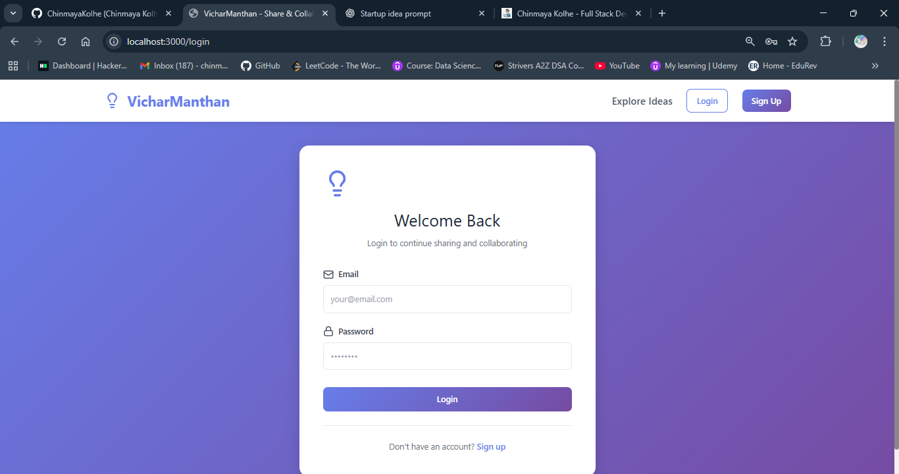

### 🔍 Explore Ideas Page
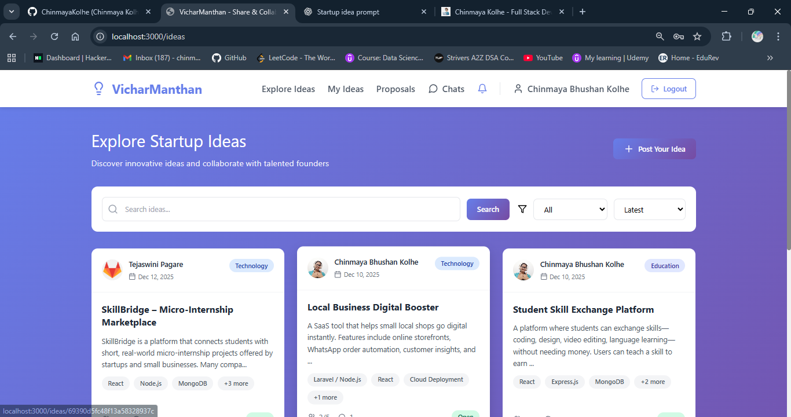

### 💡 My Ideas Page
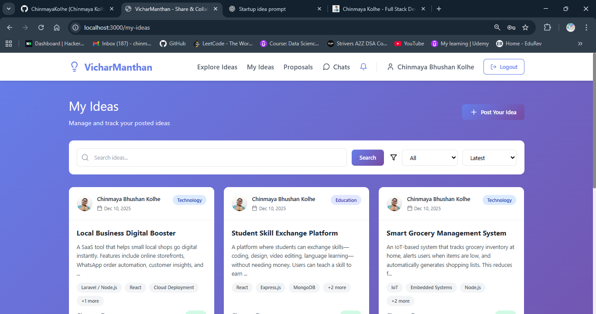

### 🚀 Create Idea Form
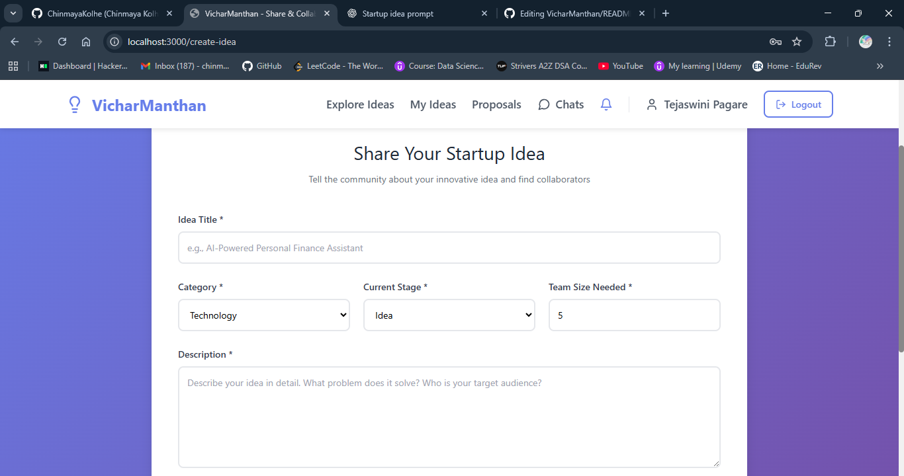

### 📩 Submitting Proposals
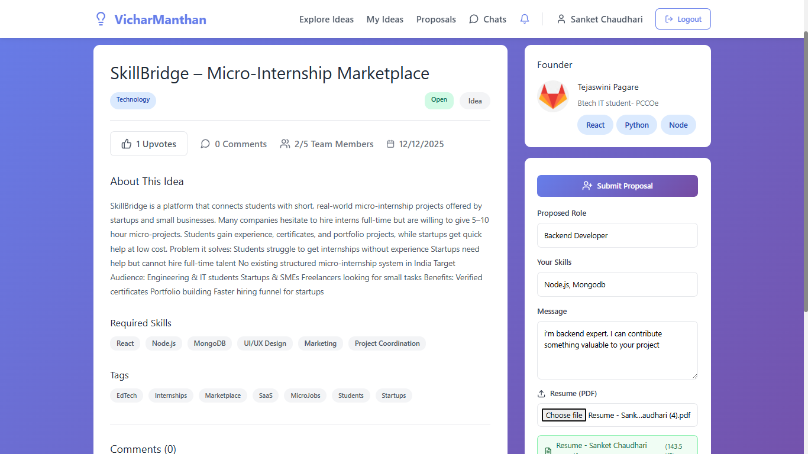

### 📄 My Submitted Proposals
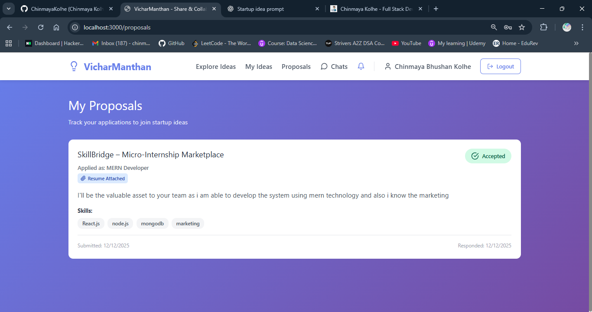

### 🗂️ Manage Proposals
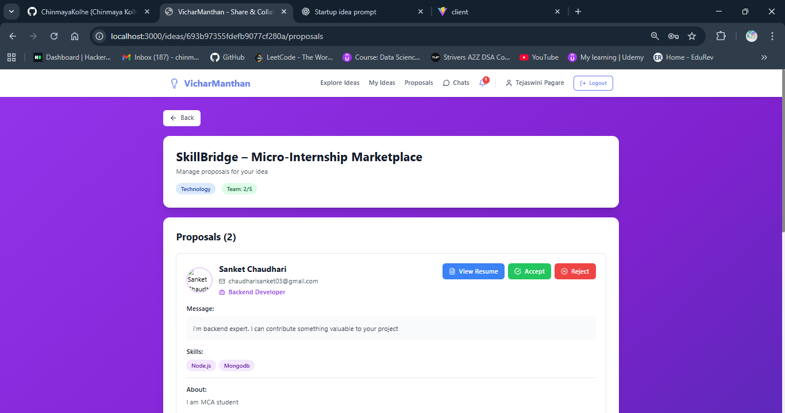

### 💬 Chat System
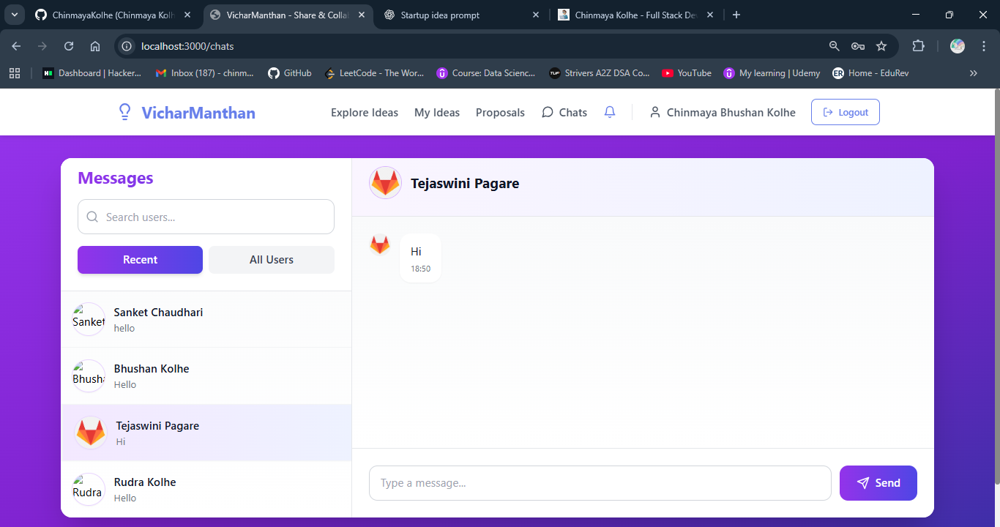

### 🔔 Notifications
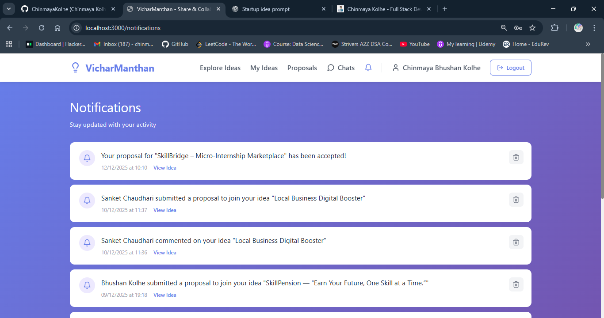

### 👤 Profile Page
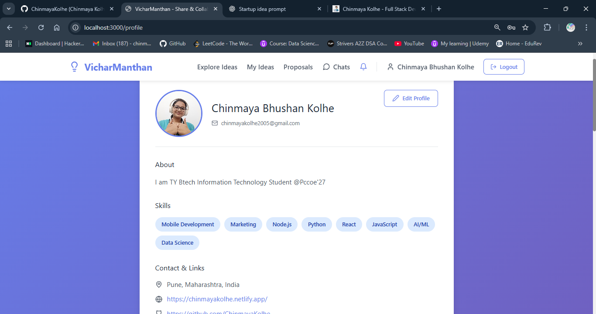


## 🔐 API Endpoints

### Authentication
- `POST /api/auth/register` - Register new user
- `POST /api/auth/login` - Login user
- `GET /api/auth/me` - Get current user

### Ideas
- `GET /api/ideas` - Get all ideas (with filters)
- `GET /api/ideas/:id` - Get single idea
- `POST /api/ideas` - Create new idea (protected)
- `PUT /api/ideas/:id` - Update idea (protected)
- `DELETE /api/ideas/:id` - Delete idea (protected)
- `POST /api/ideas/:id/upvote` - Upvote/unvote idea (protected)
- `POST /api/ideas/:id/comments` - Add comment (protected)

### Proposals
- `POST /api/proposals` - Submit proposal (protected)
- `GET /api/proposals/idea/:ideaId` - Get proposals for idea (protected)
- `GET /api/proposals/my-proposals` - Get user's proposals (protected)
- `PUT /api/proposals/:id` - Update proposal status (protected)
- `DELETE /api/proposals/:id` - Delete proposal (protected)

### Users
- `GET /api/users` - Get all users
- `GET /api/users/:id` - Get user profile
- `PUT /api/users/profile` - Update profile (protected)
- `POST /api/users/:id/follow` - Follow/unfollow user (protected)

### Notifications
- `GET /api/notifications` - Get user notifications (protected)
- `GET /api/notifications/unread-count` - Get unread count (protected)
- `PUT /api/notifications/:id/read` - Mark as read (protected)
- `PUT /api/notifications/read-all` - Mark all as read (protected)
- `DELETE /api/notifications/:id` - Delete notification (protected)

### Chats
- `GET /api/chats` - Get user chats (protected)
- `POST /api/chats` - Create/get chat (protected)
- `GET /api/chats/:id/messages` - Get chat messages (protected)
- `POST /api/chats/:id/messages` - Send message (protected)

## 🎨 UI/UX Features

- **Modern Gradient Design** - Beautiful purple gradient theme
- **Responsive Layout** - Works on desktop, tablet, and mobile
- **Real-time Updates** - Live notifications and chat messages
- **Smooth Animations** - Polished transitions and hover effects
- **Intuitive Navigation** - Easy-to-use interface

## 🔒 Security Features

- JWT-based authentication
- Password hashing with bcryptjs
- Protected routes and API endpoints
- Input validation
- CORS configuration

